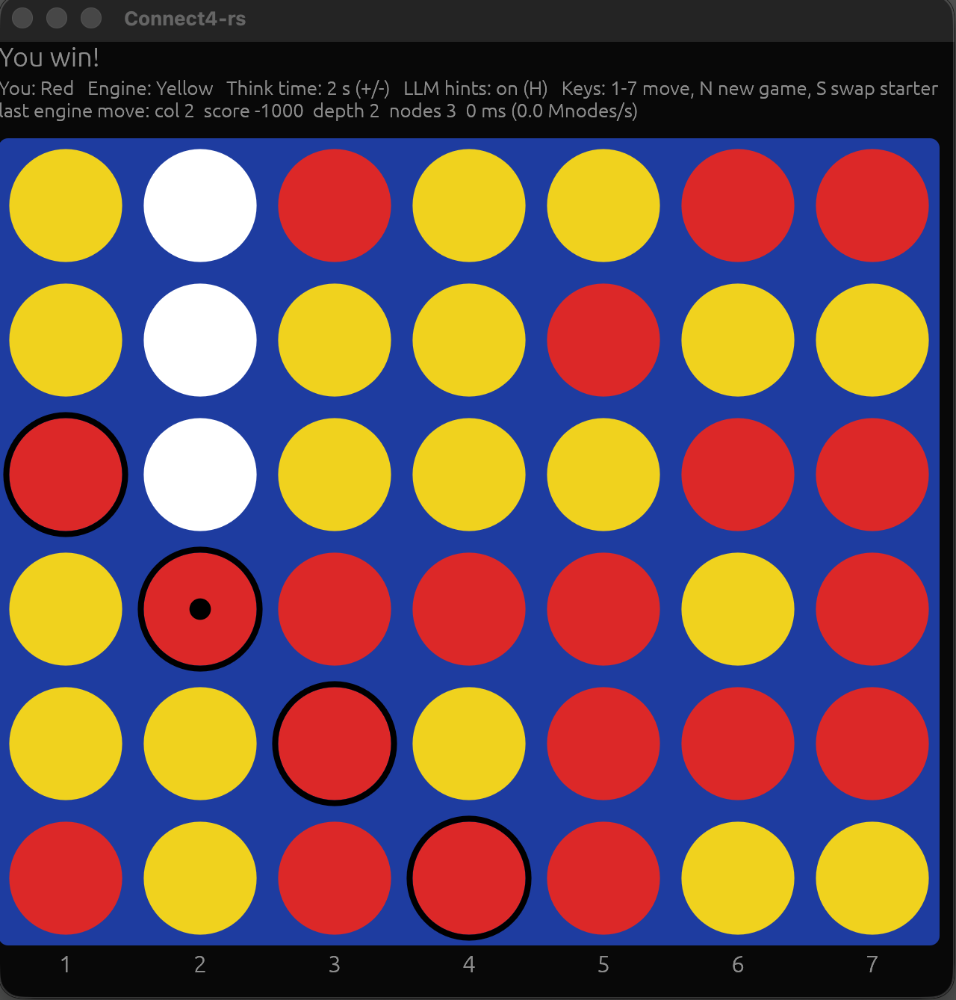

# Connect4-rs

**A Connect Four engine in Rust — play it yourself, or let your favourite
LLM try to beat it while you watch.**

The project started with the idea of seeing how strong an LLM can play
Connect Four. It turned out that the naive negamax/alpha-beta approach on
a fast heuristic incremental board score, with a few seconds of think
time per move and 10-20 MNodes/s, was beatable by an LLM:

<p align="center"></p>

*The board above is a historic moment: the first game Claude won against
the engine — more on that [below](#results-so-far).*

After that, the engine was improved step by step — see the details below.
The final engine, starting the game with only a 109 KB opening book
distilled from a perfect solver, holds the first player win against a
perfect solver (like https://github.com/PascalPons/connect4) at 2 seconds per move — while more think time without the knowledge had lost the game on the very first move.  
As a second player, the engine captures early first-player mistakes and
turns them into a win, using a 5-stone corrective book with 672
solver-verified entries — the engine's own early blind spots, mapped out
over every position of the first five stones.

Under the hood: a bitboard engine searching ~20 million positions per
second, a clean egui desktop GUI, and an
[MCP](https://modelcontextprotocol.io) server that turns the running game
into tools any LLM agent can play with.

## Highlights

* **Fast engine** — 2x`u64` bitboards, incrementally updated evaluation,
  negamax with alpha/beta, a 64 MByte transposition table, principal
  variation search (PVS) and MTD(f) (Memory-enhanced Test Driver),
  iterative deepening on a time budget. Endgames are searched to the end;
  proven wins are announced and hopeless positions resigned.
* **Human-friendly GUI** — click to drop (with a landing ghost), gravity
  drop animation, tactical hint rings, eval bar, think-time slider.
* **LLM-friendly interface** — a JSON control socket and an MCP server with
  optional tactical hints, so language models can play full games against
  the engine and you can watch live.

## Quick start

```bash
cargo build --release
cargo run --release          # the GUI (the default binary); you are red and start
```

(`cargo run` without `--bin` starts the GUI thanks to `default-run`; the
other binaries are `--bin versus`, `--bin bookgen` and `connect4-mcp`.)

Run from the repository root and the engine automatically loads the
committed opening book (`opening book loaded: 6525 positions` on stderr)
— it then plays its first six moves as first player with solver-perfect
knowledge. Requires a Rust toolchain (edition 2024, i.e. Rust ≥ 1.85).
Build in release mode — the engine is roughly 10× slower in debug.

```
src/
  engine.rs   bitboard + incremental evaluation + negamax search (no_std-style, no allocations)
  game.rs     game state shared by GUI, engine thread and control socket
  book.rs     opening book lookup (distilled from https://github.com/PascalPons/connect4, see bookgen)
  hints.rs    optional LLM assistance (tactical bookkeeping), not used by the engine
  solver.rs   adapter for an external solver (Pascal Pons line protocol)
  server.rs   control socket on 127.0.0.1:4444 (newline-delimited JSON)
  main.rs     egui/eframe GUI                        -> binary `connect4-rs`
  mcp.rs      MCP stdio server                       -> binary `connect4-mcp`
  versus.rs   automated engine-vs-solver matches     -> binary `versus`
  bookgen.rs  distills the opening book from a solver -> binary `bookgen`
  bookview.rs decodes book keys/positions to ASCII    -> binary `bookview`
```
(all binaries land in `target/release/`)

## What's there

### Engine (`src/engine.rs`)

* Two `u64` bitboards (7 bits per column); win detection in 4 shift/and ops.
* Evaluation identical to the Java `getBoardScore`: for each of the 69
  possible 4-in-a-row lines the value is the signed piece count if only one
  colour is present, else 0; ±1000 for a completed line. The sum is updated
  incrementally on `make`/`unmake` from per-line piece counts, so a node
  costs O(lines through the played square) (≤13) instead of a full scan.
* On top of that a threat/parity evaluation (the classic Connect Four
  knowledge from Victor Allis' thesis): a line with three stones of one
  colour and one empty square is a *threat* on that square. Threats on the
  right zugzwang parity (odd rows for the first player, even for the
  second) score ±24, wrong-parity ones ±6 — and per column only the
  *lowest* threat square counts, because threats above it only come alive
  after it resolves (a square both sides threaten goes to the side whose
  parity matches). Also incremental: threat transitions are detected from
  the line values already computed, so the hot path pays two extra
  compares (~13 Mn/s alone, ~11 Mn/s combined with the transposition
  table, vs ~17 for the bare evaluation).
* Negamax with alpha/beta, column order 4,5,3,2,6,1,7 (centre first),
  principal variation search (first child full window, siblings zero
  window with re-search).
* Transposition table: 2^22 entries × 16 bytes (64 MB), keyed by Pascal
  Pons' perfect 49-bit position key (`mover + occupancy + bottom row` —
  the carry marks each column's stack height), storing score, bound type
  (exact/lower/upper) and best column, always-replace.
* MTD(f) on top: each depth converges on the minimax value with a few
  zero-window searches around the previous score. Zero windows keep the
  stored bounds maximally reusable and pair naturally with PVS.
* Iterative deepening with a wall-clock budget (default 2 s, `--budget`):
  depth 1, 2, 3, … with the previous best column tried first; a new
  iteration starts only while less than a third of the budget is used, and
  an iteration running past 2× the budget is aborted (the previous result is
  kept). Stops early on a proven win/loss or when the rest of the game is
  fully searched. Replaces the Java fixed-depth heuristic (10, +1/+2 as
  columns fill).
* ~15-20 Mnodes/s single-threaded on Apple Silicon; with the table, PVS
  and MTD(f) a 2 s budget reaches depth 13 from the opening (~2× fewer
  nodes than plain alpha/beta) and proves endgames in milliseconds.

### GUI (`src/main.rs`)

When the engine's search proves a win it says so ("Engine sees a forced
win!", headline in red) instead of letting you walk into it unwarned; when
it proves its own loss it resigns ("Engine gives up") rather than playing
out the zugzwang. The socket/MCP state carries this as `resigned: true` and
in `message`.

Play with the mouse (hover shows a translucent ghost on the landing slot,
click drops the piece; pieces fall with a short gravity animation) or the
keyboard. With the hint rings on, the landing slots of tactically decisive
columns are marked: green ring = wins now, orange ring = must block, grey
ring with an x = loses immediately. The rings are a GUI-only display and
independent of the LLM hints in the socket/MCP state, so you can watch the
rings while a model plays unaided (and vice versa); both default to on.

A settings strip offers New-game, Undo and About buttons, an "engine
starts" checkbox (applies to the next game), the hint-rings toggle and a
logarithmic think-time slider (0.05–60 s). The LLM hints have no GUI
control - they default to on and are governed by `--no-hints`, the socket
command or the MCP tool. A small eval bar in the status area shows red's share
of the engine's last score: middle = balanced, full = proven win.

Keys: `1`–`7` or `a`–`g` drop a piece (the board labels its columns a–g,
matching the square notation used in the docs), `N`/`Space` new game, `S`
swap who starts (and start a new game), `U` undo your last move (works
after the engine's reply, after a lost game, and even while the engine is
still thinking), `+`/`-` double/halve the engine's think time, `L` learn from the game on
the board (see below), `H` toggle
the hint rings (GUI only; the LLM hints have their own checkbox and socket
command, see below). An **About** button opens a popup with the version,
git hash and build date, the loaded book sizes and the shortcut list. The status line shows think time and hint state; while
the engine thinks it shows the iteration depth and live node count,
afterwards score, depth, nodes and time of the last search.

Command line options (`connect4-rs --help`):

| option | effect |
|--------|--------|
| `--budget <seconds>`, `-b` | think time per engine move (default 2; `+`/`-` and the slider change it at runtime) |
| `--no-hints` | start with the LLM hints *and* the GUI hint rings off (both re-enablable at runtime) |
| `--hints` | the default: both on |
| `--solver <cmd>` | an external solver plays the engine seat (see below) |
| `--book <file>` | opening book for the engine seat; without the flag, `opening-book.txt` in the working directory is loaded automatically if present |
| `--tutor <cmd>` | solver command for the learn feature (`L` key); falls back to `$C4_SOLVER`, then to the `--solver` command |
| `--log` | trace every move to stderr: move + history, the engine's reply details (book or search, score, depth, nodes, time, resignations) and the tactical hints served to the (LLM) player |

```bash
# examples
cargo run --release -- --budget 5     # a stronger engine: 5 s per move
cargo run --release -- --no-hints     # bare start: no hints anywhere
cargo run --release -- --book my.txt  # explicit opening book (must load)
cargo run --release -- --tutor /Users/rainer/git/connect4-pp/c4solver # analyze and book the plies where the engine lost a game, solver from https://github.com/PascalPons/connect4
```

### Playing against an external solver

There is no UCI-style standard protocol for Connect Four, so `--solver`
speaks the de-facto one: [Pascal Pons' solver](https://github.com/PascalPons/connect4)
reads one position per line (the played columns as digits) and, in its
`-a` analyze mode, answers with a score per column — positive = the side
to move wins (higher = faster), negative = loses, 0 = draw. With

```bash
cargo run --release -- --solver /path/to/c4solver
```

the solver occupies the engine seat: GUI, hints, eval bar, MCP tools and
game recording all work unchanged, you (or an LLM) just face a perfect
opponent. The engine picks the solver's highest-scoring column
(centre-first tie break); a positive score triggers the "forced win"
banner — against the solver it is never bluffing. Extra arguments pass
through (`--solver '/path/c4solver -w'` for the faster weak solver), and a
`7x6.book` opening book placed next to the binary is picked up
automatically (the process runs in its own directory).

### `versus` — automated engine-vs-solver matches

```bash
cargo run --release --bin versus -- --solver /path/to/c4solver --budgets 2,10 [--book opening-book.txt]
```

plays one game per think-time budget (engine first; `--solver-starts` to
swap) and uses the solver's raw score after every engine move as ground
truth for when the engine lost the theoretical win — every game ends with
a verdict line ("theoretical win held to ply N") and the move list for
`docs/games.md`. Bookless results: at 2 s the engine opens correctly and
holds the first-player win for 4 plies; at 10 s it talks itself into a
theoretically losing b-file opening — deeper search amplifies the
heuristic's opening misjudgment instead of fixing it. Beating the solver
is not a think-time problem but an opening knowledge problem, which leads
to:

### The opening book — distilled from the solver

`bookgen` builds the book by interrogating the solver: starting from the
empty board, the first player always plays the solver's best move, every
opponent reply is expanded, and each first-player position down to six
book moves gets one solver verdict (best column + score). Transpositions
are deduplicated (19 608 raw positions → 6 525 entries), results are
appended immediately so an interrupted run resumes, and the whole
distillation took ~40 bookless minutes:

```bash
# calculate a 6 stone book with Pascal Pons solver
# Be aware that this might take some time
cargo run --release --bin bookgen -- --solver /path/to/c4solver --plies 6
```

The result is `opening-book.txt`, committed in the repo: one line per
position — position key (hex), best column (1–7), raw solver score.

The key is Pascal Pons' perfect 49-bit position encoding, computed from
the two bitboards (bit index = `column·7 + row`, row 0 = bottom row,
columns left to right; bit 6 of every column is a guard bit that never
holds a stone):

```
key = stones(side to move) + occupancy + bottom
```

where `occupancy` is all stones of both colours and `bottom` has one bit
set at row 0 of every column (0x40810204081 — also the key of the empty
board). Adding `occupancy + bottom` produces a carry that leaves a 1
exactly on top of each column's stack, which encodes every column height;
the mover's stones then encode ownership, and whose turn it is follows
from the stone count. No two distinct positions share a key, and a full
column's carry lands harmlessly in the guard bit. The same key drives the
transposition table; the authoritative definitions are `Board::key` in
`src/engine.rs` and the file parser in `src/book.rs`.

### The corrective book — the engine's early blind spots

The engine-start book cannot help when the *human* moves first (its keys
encode the side to move, and they all have the first player to move). The
second seat gets a different kind of book: `bookgen --corrective <stones>`
enumerates **every** position with up to that many stones and the engine
(second player) to move — full width, since the engine controls neither
the human's moves nor which of its own earlier replies led here. For each
position the solver delivers the verdict, and the engine is audited with
a deterministic fixed-depth version of its real search (`--depths 12,13`
by default, matching what the 2 s budget reaches): only where it would
throw away a win or a draw does the book get an entry — the shipped file
is exactly the map of the engine's early blind spots, not opening theory.

```bash
# calculate the corrective book for 3 stones
cargo run --release --bin bookgen -- --solver /path/to/c4solver --corrective 3

# check progress
wc -l corrective-audited.txt corrective-book.txt
```

The result is `corrective-book.txt`; the GUI auto-loads it alongside
`opening-book.txt` (their keys cannot collide). The full audit covers
every position up to **five stones** (4 508 engine-to-move positions,
~17 bookless solver hours): **672 corrections** — 50 from the 3-stone
band (20 % of its 245 positions), 618 from the 5-stone band (4 263
positions, 14.5 %). The 5-stone verdicts alone are instructive: after
three arbitrary first-player moves the human is still winning in only
25 % of positions, has drifted to a draw in 16 %, and has handed the
engine a won game in 58 % — the book makes sure the engine collects.
Two corrections are direct replies to a human opening: when the
human opens on `2`, only `2,3` keeps the engine's win, and after
an `6` opening only `6,5` does — the engine's search prefers the centre and
lets both slip. The rest are positions where the
human's bad opening hands the engine a won game that only one unintuitive
move keeps (after `1,2,2` only `1,2,2,2` wins; after `5,2,1` only `5,2,1,6`; after
`7,7,6` even the draw hangs on the f-column). A killed run loses
nothing: corrections are flushed line by line,
re-runs keep existing entries, and `--skip <n>` resumes the deterministic
audit order. `scripts/validate_book.py` replays every entry onto the
running GUI and checks the engine answers with the booked move, from the
book.

#### Learning from lost games

The exhaustive audit ends at a few stones, but the engine can also study
its individual losses ("the engine's opening preparation"): with the lost
game still on the board, press `L` (or send `{"cmd":"learn"}` on the
socket, or first `replay` any recorded game). After a confirmation dialog
the solver traces every engine-to-move position of the game and books each
ply where the engine threw away a win or a draw — appended to
`corrective-book.txt` with a provenance comment (`# learned from <game>
(threw win at ply N)`; everything after `#` is a comment in the book
format) and inserted into the live book, so replaying the opponent's
winning line immediately breaks at the corrected ply. The solver command
comes from `--tutor`, `$C4_SOLVER` or the `--solver` seat; positions that
the audit already covers report "already covered", and a game the
opponent won on merit reports exactly that. First proof: kimi-k3's win
(game 11 in [docs/games.md](docs/games.md)) was analyzed this way — the
engine had thrown a won game at ply 12 (only e keeps it, it played c);
one `learn` later the replay deviates there, from the book.

Keys are exactly invertible, and the `bookview` tool makes them readable:

```bash
cargo run --release --bin bookview -- 80810204086   # a key from a book file
cargo run --release --bin bookview -- 1,2,2         # or a move list
```

prints the ASCII board, the side to move, a legal move history reaching
the position (reconstructed by backtracking - transpositions may yield a
different but equivalent one), the entries any present book files hold for
it, and a ready-to-paste `replay` command that pushes the position onto
the running GUI. The engine seat consults it before searching (`--book <file>`, or
automatically when `opening-book.txt` sits in the working directory —
both the GUI and `versus`). A book hit plays the book move, but is not
reported as a forced win: the status line and the socket/MCP state mark
it as a book move (`book: true`), and a short search (a quarter of the
budget) supplies the engine's own evaluation for the score display — the
forced-win banner stays reserved for the engine's own proofs and the
solver seat. **With the book, the engine beats the perfect solver as first
player at a 2 s budget** — the solver's move-by-move verdict never
leaves −1, the unassisted heuristic middlegame (plies 13–25) holds the
unique win by itself, the engine's own proofs take over from ply 25 and
convert on stone 41, the latest a perfect defender can be beaten
(game 10 in [docs/games.md](docs/games.md)).

Without the opening book the solver's first one or two moves solve
nearly-empty boards from scratch — measured here: 6 min 47 s for the empty
board (Apple Silicon), which incidentally reproduces the famous
perfect-play result live: column scores `-2 -1 0 1 0 -1 -2`, only the
centre opening wins. The process is kept alive between moves, so once
warmed up it answers instantly; replayed midgame positions are answered
immediately even bookless. The weak solver (`-w`) is several times
faster if you want bookless games from scratch. If a solver query fails,
the built-in engine plays that move instead.

### Control socket (`src/server.rs`)

The GUI listens on `127.0.0.1:4444`, one JSON object per line:

```
{"cmd":"state"}
{"cmd":"move","col":4}             # 1..7, blocks until the engine has answered
{"cmd":"new","engine_starts":false}
{"cmd":"hints","on":true}          # toggle LLM hints, returns the state
{"cmd":"replay","moves":[4,4,…]}   # replay a full game, both sides' columns
{"cmd":"learn","solver":"…"}       # book the engine's mistakes in this game
```

Example:

```bash
printf '{"cmd":"replay","moves":[4,4,4,4]}\n' | nc 127.0.0.1 4444
printf '{"cmd":"learn","solver":"/Users/rainer/git/connect4-pp/c4solver"}\n' | nc 127.0.0.1 4444
```

Replies contain the board (`rows`, top row first, `R`/`Y`/`.`), `status`
(`human_to_move`, `thinking`, `{"won":"human"|"engine"}`, `draw`),
`to_move`, `history` (columns played so far), `last_search`
(engine column, depth, nodes, millis, score) and, when enabled, `hints`.

### LLM hints (`src/hints.rs`) — optional, on by default

When LLMs play over the socket their losses are mostly bookkeeping errors
(miscounting a column's height, overlooking a vertical three), not strategy.
To separate the two, the state can carry one-ply tactical hints:

* `next_row` — next free row per column (1 = bottom, `null` if full)
* `winning_moves` — columns that complete four right now
* `must_block` — columns where the opponent wins next move
* `losing_moves` — columns after which the opponent has an immediate win

This is **assistance for the client only**; the engine never sees it. On by
default; disable with `--no-hints` at startup, or toggle at runtime with
`{"cmd":"hints","on":…}` on the socket or the `connect4_hints` MCP tool,
and compare a model's results with and without. The GUI's hint rings
are a separate, display-only flag (`H` key / "Hint rings" checkbox), so
turning the rings off never changes what a model sees.

### MCP server (`src/mcp.rs`)

`connect4-mcp` is a stdio MCP server (hand-rolled JSON-RPC, no framework)
that forwards four tools to the running GUI:

| tool             | arguments                        |
|------------------|----------------------------------|
| `connect4_new`   | `engine_starts: bool` (default false) |
| `connect4_move`  | `col: 1..7`                      |
| `connect4_state` | –                                |
| `connect4_hints` | `on: bool` — LLM assistance toggle |

Each result is a text rendering of the board (plus a `hints:` line when
enabled) followed by the raw JSON state.

## Test

```bash
cargo test --release
```

Unit tests in `engine.rs` check the line tables, that the incremental score
matches a full-scan reference port of the Java evaluation over random
playouts, that the search finds immediate wins and blocks, and that a real
zugzwang endgame is proven within the budget, the threat/parity evaluation
matches an independent full-scan reference over random playouts and weighs
odd/even-row threats as intended; a search with a warm transposition table
is checked against a plain no-table negamax on positions solved to the end
of the game; `hints.rs` tests the win/block/losing-move detection. A slower
test replays the recorded lost game: at ply 18 even a 10 s search cannot
prove the loss (it is beyond a depth-20 horizon), while at ply 20 the loss
is proven quickly. An ignored `analyse_recorded_win` helper prints the 10 s
evaluation of every engine move of that game.

Search benchmark (ignored by default, prints depth reached and nodes/s for
a 0.5 s and a 2 s budget):

```bash
cargo test --release bench_search -- --ignored --nocapture
```

## Play

### Yourself, in the GUI

`cargo run --release` — you play red and move first; use the settings strip
or press `S` to let the engine start.

### From a script or shell

With the GUI running, talk to the control socket directly:

```bash
printf '{"cmd":"move","col":4}\n' | nc 127.0.0.1 4444
```

### Letting an LLM play against it

Any MCP-capable model/agent can play through `connect4-mcp`. The flow is
always: start the GUI, register the MCP server, then ask the model to play.

1. Build and start the GUI (it owns the engine and the socket):

   ```bash
   cargo run --release
   ```

2. Register the MCP server with your client. For **Claude Code** this repo
   already ships a project-level [`.mcp.json`](.mcp.json):

   ```json
   {
     "mcpServers": {
       "connect4": { "command": "/Users/rainer/git/Connect4-rs/target/release/connect4-mcp" }
     }
   }
   ```

   Adjust the path to your checkout. Start `claude` in this directory and the
   `connect4_*` tools are available. Alternatively, register it globally:

   ```bash
   claude mcp add connect4 -- /path/to/Connect4-rs/target/release/connect4-mcp
   ```

   The same stdio command works for other clients — e.g. Claude Desktop
   (`claude_desktop_config.json`), Cursor, Codex, Gemini CLI, or any MCP SDK —
   because the server only needs a `command` with no arguments or env.

3. Ask the model to play, e.g.

   > Play a game against Connect4-rs. Start a new game, then alternate
   > connect4_move calls until the game is over. Think about threats and
   > parity before each move.

   Hints are on by default; ask the model to call `connect4_hints` with
   `on=false` first to test it unaided.

   The model calls `connect4_new`, then `connect4_move` repeatedly; every
   reply already includes the engine's answer, so one tool call per turn is
   enough. The board updates live in the GUI window.

To test a model without an MCP client, drive the socket from any language
and feed the JSON state into the model's prompt; the protocol is the three
commands above.

### Results so far

Claude (Fable 5) vs. the engine seat: **8 – 2** (including one game
against the perfect solver). Every engine version won in its own
characteristic way — which is what this repo is about.

Without hints, Claude lost all three games — twice at fixed depth 10 (a
parity/zugzwang squeeze in 34 plies; a diagonal + vertical double threat in
17) and once against the 2 s budget (18 plies, after miscounting a column
height and handing the engine a double diagonal). Every loss traced back to
a bookkeeping error, not strategy — which is what motivated the hints.

With hints on, Claude (red) beat the engine (2 s budget, depth 12–20) —
that game's final position is the screenshot at the top of this page, with
the winning line circled.

Protocol of the win (columns 1–7; `Rc`/`Yc` = red/yellow drop in column
c; squares in chess-like notation, columns a–g, rows 1–6 bottom up):

| # | moves | note |
|---|-------|------|
| 1–6 | R4 Y4, R4 Y4, R5 Y6 | centre stack, then both extend row 1 |
| 7–12 | R3 Y2, R5 Y4, R5 Y5 | red builds column 5 / row 3; yellow takes d4/d5 |
| 13–14 | R5 Y4 | **e5**: kills the two yellow diagonals through that hinge (they decided game 3); yellow fills column 4 |
| 15–16 | R1 Y5 | **a1** prophylaxis: the a1–d4 diagonal is dead for good |
| 17–20 | R3 Y1, R3 Y3 | red takes **c3** (row 3 trio) — engine eval drops to −1000: column 2 is frozen, b3 wins for both sides but red's claim sits below |
| 21–24 | R6 Y6, R6 Y7 | forced sequence in column 6: yellow must block row 3, red must block row 4 |
| 25–26 | R7 Y1 | hint-flagged forced block: g2 would have completed yellow's d5–g2 diagonal |
| 27–28 | R1 Y1 | red breaks yellow's column-1 vertical |
| 29–34 | R7 Y1, R7 Y7, R7 Y6 | red's **column-7 vertical threat** forces yellow's block — the tempo gain that wins the zugzwang |
| 35–38 | R6 Y3, R3 Y2 | red seals row 6, blocks c6; yellow is out of safe squares and must enter column 2 |
| 39 | **R2** | b3 completes two fours at once: 2-3-4-5 on row 3 and the d1–a4 diagonal (circled in the screenshot at the top) — red wins |

The hints did exactly what they were built for: they caught the two forced
blocks and kept the column heights straight, while the strategy (the e5
prophylaxis, freezing column 2, the tempo fight) was the model's own.
(The second Claude win was against the engine of the `transposition-table`
branch, which deviated from the recorded line exactly where a 10 s analysis
predicted but lost to the same column-2 freeze and resigned after 19 plies.)

The threat-aware engine of this branch then beat Claude twice, playing a
visibly different, constructive style at only depth 11–13: in game one it
stacked two win squares in one column (e3 diagonal under e4 row) so no
single block answered; in the rematch Claude avoided every earlier mistake
- reversed a trap so the engine had to block with a useless stone, killed
three lines with one prophylactic move - and still lost to a row-5 trio
whose completion squares were protected by an older diagonal underneath:
threats defending threats. Where the original evaluation won on tactics
and Claude's bookkeeping errors, the threat evaluation builds winning
structures on its own - and its optimism tracked real advantages instead
of preceding losses.

The combined engine then won the showdown game with a third kind of win:
an engineered zugzwang. It arranged its win squares *below* Claude's in
both remaining open columns, sealed the parity with a quiet a1 - and
announced the forced win at depth 15 the moment it did - then burned the
neutral squares until Claude ran out of safe moves. That is exactly the
strategy Claude had used to beat the simple engine in its first win,
played back without hints and proven fifteen plies out: the threat
evaluation supplied the structure, the transposition-table search the
proof and the flawless execution.

The engine, armed with a 6-move opening book distilled from the solver
itself (`bookgen`), then beat the perfect solver as first player at a 2 s
budget — holding the theoretical win over the full 41 plies: book
(plies 1–11), unassisted heuristic (13–25, verdict never worse than −1),
own proofs (25–41). Game 10 in [docs/games.md](docs/games.md).

Earlier, Claude played the perfect solver (`--solver`, game 9 in
[docs/games.md](docs/games.md)) — and perfection turned out to be the
best teacher: Claude held the theoretical win for eight plies before a
tempo-grabbing forcing move dropped it to a draw (the solver proved that
in a millisecond) and an overeager consolidating move dropped the draw
two plies later. The solver's scores pinpointed the exact two mistakes
in real time, and its finish was the same stacked double every strong
engine in this repo has used: a forced block directly beneath the
winning square.

The win reproduces against the stronger engine of this branch
(transposition table + PVS + MTD(f), depth 13-17 at the same 2 s budget):
the deeper engine deviated from the recorded game exactly where the 10 s
analysis predicted (e6 at ply 14 - then it transposed straight back -
and g1 instead of the fatal a2 at ply 18), but the c3 freeze of
column 2 wins against both tries. This time the engine proved its loss at
depth 20 within 226 ms and resigned on the spot after 19 plies. The losing
mistake therefore lies before ply 18; positionally understanding such
frozen-column structures long before they are provable is what the
threat-aware evaluation below is about.


### Branches: watching the engine get stronger

The engine improvements live in separate branches so their effect on play
can be observed in isolation — each branch's README carries its measured
results, and the games against Claude make the differences tangible:

* **`simple-engine`** — this version: the original Java evaluation and
  plain negamax/alpha-beta with iterative deepening. Won its games through
  tactics and the opponent's bookkeeping errors; lost to Claude once the
  LLM hints removed those errors.
* **`transposition-table`** — adds a transposition table, principal
  variation search and MTD(f): ≈2× fewer nodes, depth 13–17 instead of
  11–13 at the same 2 s budget, endgame proofs in milliseconds. Deviated
  from the recorded losing line exactly where a 10 s analysis predicted —
  and still lost to the same positional freeze, then resigned: depth alone
  does not buy understanding.
* **`threat-eval`** — adds the threat/parity evaluation (Allis): threats
  weighted by row parity, only the lowest threat per column counts. At
  depth 11–13 it plays a visibly constructive style — stacked win squares,
  threats defending threats — and beat Claude twice.

* **`combined-engine`** — both improvements merged, the threat/parity
  evaluation searched at transposition-table depth. This is what `main`
  now carries.

Measured on the recorded lost game, the two improvements attack the same
blindness from opposite sides: the deeper search deviates from the losing
line where a 10 s analysis predicted but still cannot prove the loss at
ply 18, while the threat evaluation turns negative from ply 12 on
(−18/−9/−28/−16 instead of +4…+13) — it senses the frozen-column
structure plies before it is provable. Each branch README carries the
detailed numbers; `main` carries the strongest (combined) version while
each step stays observable in its branch.

## Credits

This project builds on the work and ideas of others:

* [Connect4](https://github.com/RainerZ/Connect4) by Rainer Zaiser — the
  origin of this repo: a first Java/JavaFX practice project whose engine
  evaluation (the signed line-count board score) is ported here 1:1 and
  still forms the base layer of the evaluation.
* [Pascal Pons' Connect 4 solver](https://github.com/PascalPons/connect4)
  and his outstanding step-by-step
  [solving tutorial](http://blog.gamesolver.org/) — the perfect 49-bit
  position key used by the transposition table, the line protocol spoken
  by the `--solver` seat, the ground truth behind `versus`, and the
  source the opening book is distilled from. Play his solver online at
  [connect4.gamesolver.org](https://connect4.gamesolver.org).
* Victor Allis,
  [*A Knowledge-Based Approach of Connect-Four*](https://web.archive.org/web/20161221134811/http://www.informatik.uni-trier.de/~fernau/DSL0607/Masterthesis-Viergewinnt.pdf)
  (Master's thesis, Vrije Universiteit Amsterdam, 1988) — the threat and
  zugzwang-parity theory behind the threat-aware evaluation; Allis (and
  independently James D. Allen) first proved Connect Four a first-player
  win.
* Aske Plaat et al.,
  [*Best-First Fixed-Depth Minimax Algorithms*](https://askeplaat.wordpress.com/534-2/mtdf-algorithm/)
  — the MTD(f) algorithm driving the search; alpha-beta pruning and
  principal variation search go back to Knuth & Moore and Marsland &
  Campbell.
* [egui/eframe](https://github.com/emilk/egui) by Emil Ernerfeldt — the
  immediate-mode GUI the board is drawn with.
* The [Model Context Protocol](https://modelcontextprotocol.io) — the
  interface that lets LLMs sit down at the board.

Development of the Rust port, the engine experiments and the games
documented here: a collaboration between Rainer Zaiser and Anthropic's
Claude (Fable 5) in [Claude Code](https://claude.com/claude-code).
